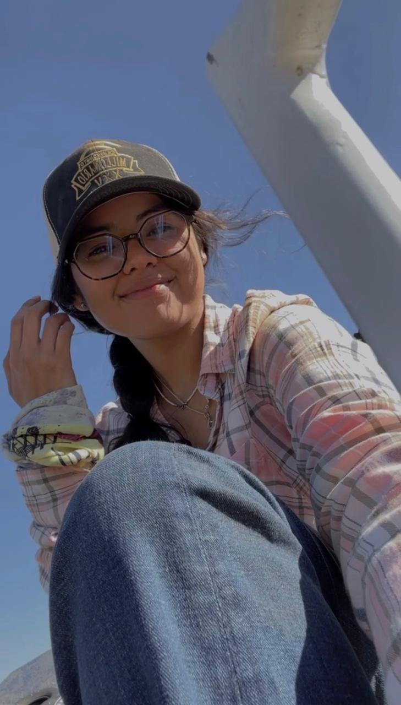

# MONICA MUÑOZ :)

## Education
Bachelors at [Universidad Autonoma de Guadalajara](https://www.uag.mx)

Masters studies at [Clark Univeristy](https://www.clarku.edu/)

## Research interests
During my undergraduate studies I was part of a soil quality project research project for Tequila quality and have helped mapping new species observation in Jalisco, Mexico.   I am very interested in water quality and management as well. For now, I'd like to be part of project for conservation and/or restoration of natural resources and biodiversity.